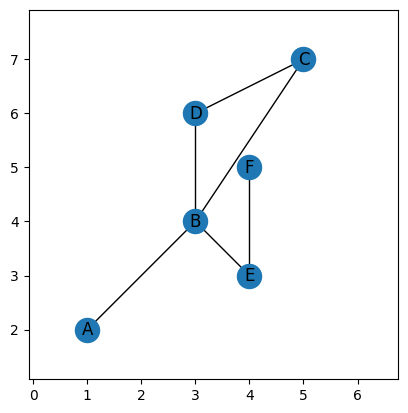

# Summary

TODO

# The ECT

**TODO: Get permission for the Matisse example image**

We start by defining the Euler Characteristic Transform, and direct the reader to [@Munch2025] for a full survey article on the subject. 

To start, we assume our input is an undirected graph $G$ with an embedding in 2D given by a map on the vertices $f: V(G) \to \mathbb{R}^2$. A graph can be constructed as follows. 

TODO..... Liz is going to steal content from the tutorials for this. 

# Statement of need

**TODO: Are there any existing ECT packages?**

Yemeen is going to find any needed references.

# Representative Publications Using ECT

Have we actually used it yet? 

# Acknowledgements

This material is based in part upon work supported in part by the National Science Foundation through grants
CCF-1907591,
CCF-2106578,
and CCF-2142713.
**Get the rest?**

# References
