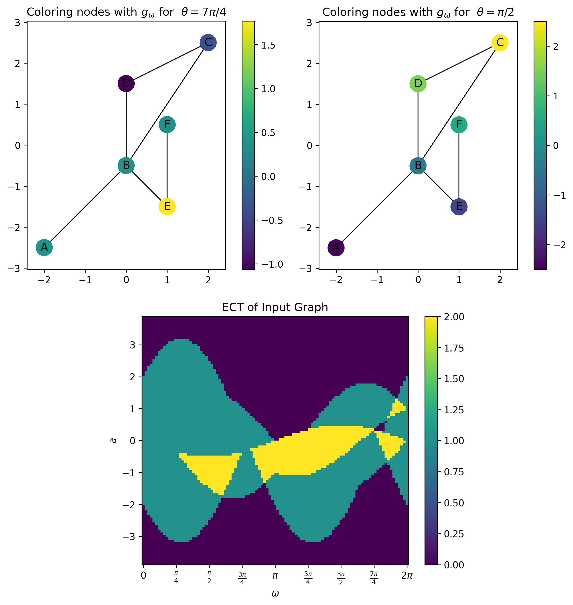
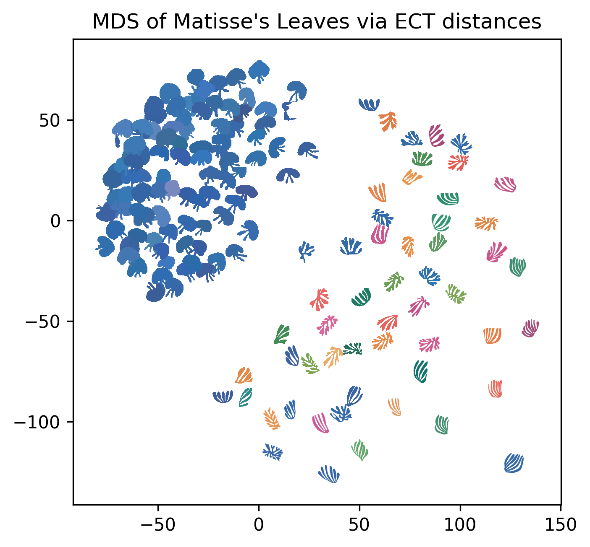

# Summary

The field of Topological Data Analysis encodes the shape of data in quantifiable representations of the information, sometimes called "topological signatures" or "topological summaries". 
The goal is to ensure that these summaries are robust enough to be useable in the face of noise, while having access to fast enough algorithms to make them useful in practice. 
Often, these two goals are at odds with each other since the more complex the representation in order to retain as much information as possible generally results in larger computation time.  
The Euler Characteristic Transform (ECT) is a construction which is rapidly gaining popularity in Topological Data Analysis settings due to its ability to be both at once: robust to the input providing a provably complete representation of an input embedded shape, while being much faster to compute than its commonly used cousin, the Persistent Homology Transform. 
The *ECT* package for Python presented here provides a fast and well-documented implementation of the ECT for graphs embedded in 2 or 3 dimensions. This new package is particularly timely since access to easy-to-use code will make the ECT accessible to more practitioners and domain scientists interested in using it for applications. ***TODO Assuming we actually have this up to 3d***

# The ECT

We start by defining the Euler Characteristic Transform. 
This construction came to the attention of the TDA community beginning with a proof of injectivity of the representation for simplicial complexes embedded in dimension up to 3 by Turner *et al.* [@Turner2014]. 
Subsequently, using the machinery of Euler calculus @Schapira1995, this theorem was extended concurrently by [@Ghrist2018] and [@Curry2022] to nice enough subsets in any ambient dimension.
We direct the reader to [@Munch2025] for a full survey article on the subject. 

To start, we assume our input is an undirected graph $G$ with an embedding in 2D given by a map on the vertices $f: V(G) \to \mathbb{R}^2$. A graph can be constructed as seen in \autoref{fig:example_graph}. 

<!-- { width=20% } -->

For a choice of direction $\theta \in [0,2\pi]$, we can induce a function on the vertex set. 
Thinking of this as $\omega \in \mathbb{S}^1$ by defining the unit vector $\omega = (\cos(\theta), \sin(\theta))$, the function $g_\omega$ is defined on the vertices of $G$ by taking the dot product of the embedding coordinates with the unit vector, specifically
$$
g_\omega(v) = \langle f(v), \omega\rangle.
$$
<!-- This is done in the code using the `g_omega` method as shown.  -->
Some examples are shown in \autoref{fig:example_graph}. 

Now we can set up the ECT for the embedded graph. The ECT is defined as 
$$
\begin{matrix}
\text{ECT}(G): & \mathbb{S}^1 & \to & \text{Func}(\mathbb{R}, \mathbb{Z})\\
& \omega & \mapsto & \{ a \mapsto \chi(g_\omega^{-1}(-\infty,a]) \}
\end{matrix}
$$
Perhaps a better way of looking at this same function for visualization purposes is to treat this function as defined on a cylinder,
$$
\begin{matrix}
\text{ECT}(G): & \mathbb{S}^1 \times \mathbb{R} & \to &  \mathbb{Z}\\
& (\omega,a) & \mapsto & \chi(g_\omega^{-1}(-\infty,a]).
\end{matrix}
$$
After discretizing, the example embedded graph has an ECT matrix as shown in the bottom row of \autoref{fig:example_graph}.
The main functionality of the `ECT` package is to be able to compute the ECT matrix for graphs embedded in $\mathbb{R}^d$ for $d \in \{2,3\}$.

## Extension to higher dimensional embedding

In theory, the ECT can be defined for a space embedded in $\mathbb{R}^d$ for any $d$. 
In practice, for applications geared toward encoding shapes seen in the physical world, this is largely limited to the cases $d=2$ or $d=3$. 
Still, issues arise in applications in the case of $d=3$ where the choice for discretizing the directions chosen on the sphere $\mathbb{S}^2$ is not canonical like the case of $d=2$ and the circle $\mathbb{S}^1$ [@Mardia1999]. 
To this end we have implemented **Make sure this is true** the 3D ECT for graph inputs. 
In order to handle issues with choices of direction discretiziations, we have implemented multiple options for sampling, **Which ones? **
- Uniform in $\theta$ and $\rho$? 
- Whatever other sampling methods I can find in that directions book. 
- From wikipedia: 
  - [Kent distribution](https://en.wikipedia.org/wiki/Kent_distribution) 
  - [von Mises-Fisher](https://en.wikipedia.org/wiki/Von_Mises%E2%80%93Fisher_distribution#Matrix_Von_Mises-Fisher)

**TODO: add in stuff about the CW complex inputs**
- CW Complexes might be too broad a term. Perhaps "[polygon mesh](https://en.wikipedia.org/wiki/Polygon_mesh)" is better. 

## Distances 

Additional code is included for computing distances between the resulting ECT matrices. 

## Generalized versions of ECT

The ECT package provides implementations for both the Smooth Euler Characteristic Transform and the Differentiable Euler Characteristic Transform. This allows for users to quickly examine their dataset under the lense of various topological transforms to find what best suits their problem.

# Statement of Need

Despite the ECT's mathematical elegances, there has been a notable absense of efficient, user-friendly Python implementations that can handle the computational demands of modern research datasets. The ECT package addressed this by leveraging Numba's just-in-time compilation to achieve significant speedups over naive Python implementations, making it practical to compute ECTs for large-scale datasets. This performance is then complimented by the many utility functions for visualizing and comparing different Euler Characteristic Tranforms such as the ECT, SECT, and the DECT.

Yemeen is going to find any needed references.

- DECT 
- Demeter 
- 

# Representative Publications Using ECT

Have we actually used it yet? 

# Acknowledgements

This material is based in part upon work supported in part by the National Science Foundation through grants
CCF-1907591,
CCF-2106578,
and CCF-2142713.
**Get the rest?**

# References
