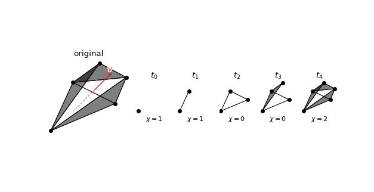

# Summary

The field of Topological Data Analysis [@Dey2021;@Wasserman2018;@Ghrist2014;@Munch2017] encodes the shape of data in quantifiable representations of the information, sometimes called "topological signatures" or "topological summaries". The goal is to ensure that these summaries are robust to noise and useful in practice. In many methods, richer representations bring higher computation cost, creating a tension between robustness and speed. The Euler Characteristic Transform (ECT) [@Turner2014;@Munch2025;@Rieck2024] has gained popularity for encoding the information of embedded shapes in $\mathbb{R}^d$--such as graphs, simplicial complexes, and meshes--because it strikes this balance by providing a complete topological summary, yet is typically much faster to compute than its widely used cousin, the Persistent Homology Transform [@Turner2014].

The `ect` Python package offers a fast and well-documented implementation of ECT for inputs in any embedding dimension and with a wide range of complex types. With a few lines of code, users can generate ECT features by sampling directions, computing Euler characteristic curves, and vectorizing them for downstream tasks such as classification or regression. The package includes practical options for direction sampling, normalization, and visualizing various versions of the ECT. These options allow for smooth integration into other scientific packages such as `Numpy`, `Scipy`, and `PyTorch`. By lowering the barrier to computing the ECT on embedded complexes, `ect` makes these topological summaries accessible to a wider range of practitioners and domain scientists.

## The Euler Characteristic Transform

The Euler characteristic is a standard construction from algebraic topology (see, e.g., @Hatcher). 
In its simplest form, for a given polyhedron $K$, it is defined as the alternating sum $\chi(K) = v_K-e_K+f_K$ where $v_K$, $e_K$, and $f_K$ stand for the counts of the numbers of vertices, edges, and faces in $K$, respectively.
The ECT extends this idea to encode the changing Euler characteristic for sublevel sets of an input space in different directions.
We give a high-level introduction of the ECT here as defined in [@Turner2014], and direct the reader to [@Munch2025;@Rieck2024] for full survey articles specifically on the subject. 
<!-- Further, note that the code is built to handle embedded cell complexes of arbitrary dimension, but for ease of introduction, we explain the basics using embedded graphs. -->

To start, we have input `ect.EmbeddedComplex`, which is a polyhedral complex $K$ (see @Goodman2018, Ch. 17.4) that is a collection of convex polytopes in $\mathbb{R}^n$ closed under the face relation. While we note the code can handle shapes in any dimension, we will give an exposition focusing on the case of a straight-line graph embedding like the example given in \autoref{fig:example_graph} embedded in $\mathbb{R}^2$.

For a choice of direction $\omega \in \mathbb{S}^{n-1}$, we induce a function on the vertex set given by $g_\omega(v) = \langle f(v), \omega\rangle$, the dot product of the embedding coordinates of the vertex with the unit vector $\omega \in \mathbb{R}^n$. 
Some examples are shown for the embedded graph in \autoref{fig:example_graph}. 
The ECT for the embedded graph is given by
$$
\begin{matrix}
\text{ECT}(G): & \mathbb{S}^1 \times \mathbb{R} & \to &  \mathbb{Z}\\
& (\omega,a) & \mapsto & \chi(g_\omega^{-1}(-\infty,a]).
\end{matrix}
$$
After discretizing, the example embedded graph has an ECT matrix as shown in the bottom row of \autoref{fig:example_graph}.

<!--  -->

<!-- ## Extension to higher dimensional embedding

In theory, the ECT can be defined for a space embedded in $\mathbb{R}^d$ for any $d$. 
In practice, for applications geared toward encoding shapes seen in the physical world, this is largely limited to the cases $d=2$ or $d=3$. 
Still, issues arise in applications in the case of $d=3$ where the choice for discretizing the directions chosen on the sphere $\mathbb{S}^2$ is not canonical like the case of $d=2$ and the circle $\mathbb{S}^1$ [@Mardia1999]. 
To this end we have implemented **Make sure this is true** the 3D ECT for graph inputs. 
In order to handle issues with choices of direction discretiziations, we have implemented multiple options for sampling, **Which ones? **
- Uniform in $\theta$ and $\rho$? 
- Whatever other sampling methods I can find in that directions book. 
- From wikipedia: 
  - [Kent distribution](https://en.wikipedia.org/wiki/Kent_distribution) 
  - [von Mises-Fisher](https://en.wikipedia.org/wiki/Von_Mises%E2%80%93Fisher_distribution#Matrix_Von_Mises-Fisher)

## Capabilities of the `ect` package 

The main functionality of the `ect` package is to compute the ECT using the class `ect.ect.ECT`, including for higher-dimensional structures than described in the previous section.
This can be modified to accept different choices of subsets of directions of the sphere $\mathbb{S}^{n-1}$, including uniform and random sampling methods.
Variants of the ECT are also implemented, including the Smooth Euler Characteristic Transform (SECT) [@Crawford2019;@Meng2022]; and the Differentiable Euler Characteristic Transform (DECT) [@Roell2024]. 
The ECT output can also easily return distances between transforms, generally defined as the $L_p$ distance between two functions $ECT(K_1), ECT(K_2):\mathbb{S}^{n-1} \times \mathbb{R} \to \mathbb{Z}$.

<!--  -->

# Statement of Need

Despite the ECT's mathematical power, there has been a notable absence of efficient, user-friendly, continuously maintained Python packages that can handle the computational demands of modern research datasets. The primary target users of `ect` are researchers and practitioners in topological data analysis and related fields (such as computational geometry, network science, and biological shape analysis) who require scalable, Python-native tools for extracting and using topological features from embedded complexes. The `ect` package addresses this by leveraging Numba's just-in-time compilation to achieve significant speedups over naive Python implementations, making it practical to compute ECTs for large-scale datasets. This performance is then complemented by the many utility functions for visualizing and comparing different Euler Characteristic Transforms such as the ECT, SECT [@Crawford2019;@Meng2022], and the DECT [@Roell2024].

# Acknowledgements

This material is based in part upon work supported in part by the National Science Foundation through grants
CCF-1907591,
CCF-2106578,
and CCF-2142713.
This work was also supported by US National Science Foundation Plant Genome Research Program awards (IOS-2310355, IOS-2310356, and IOS-2310357).

# References
