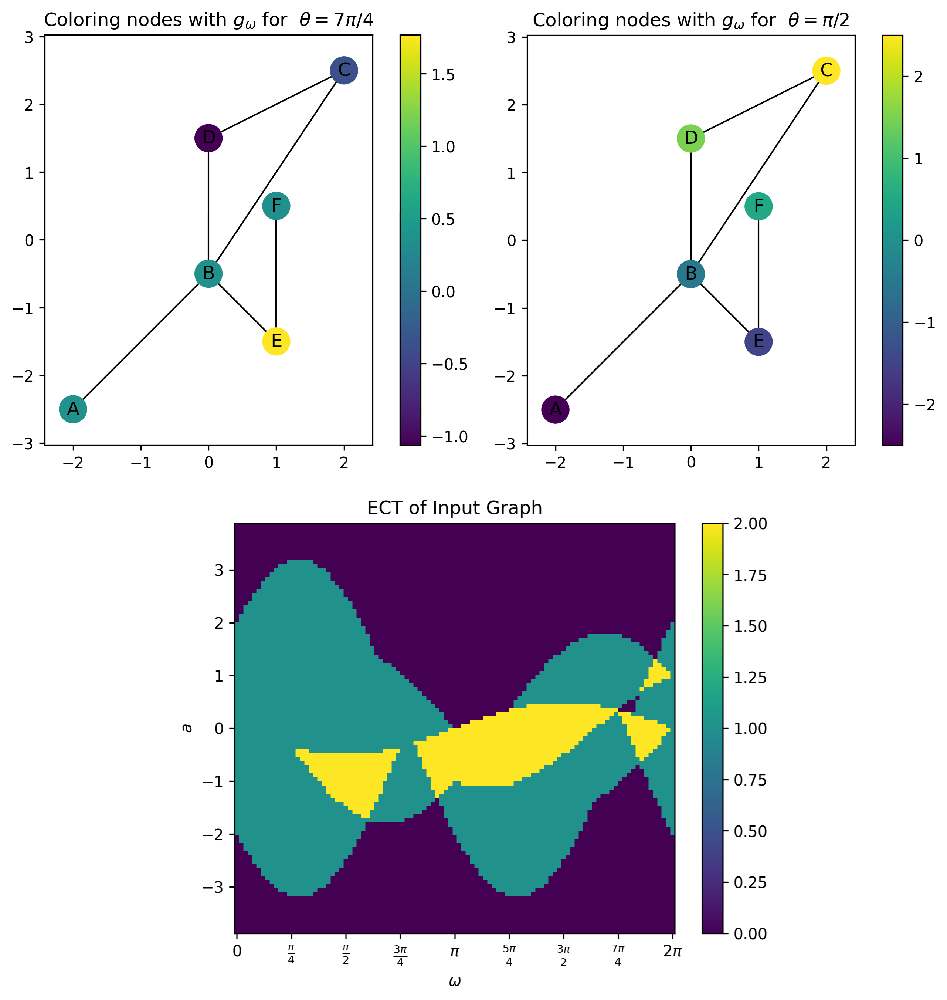
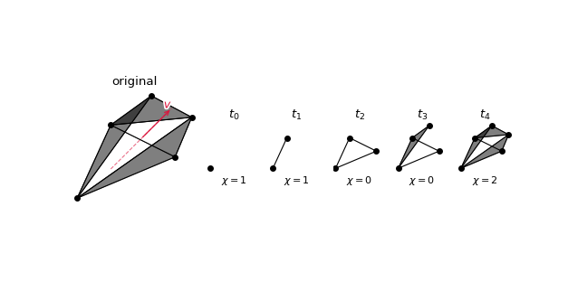
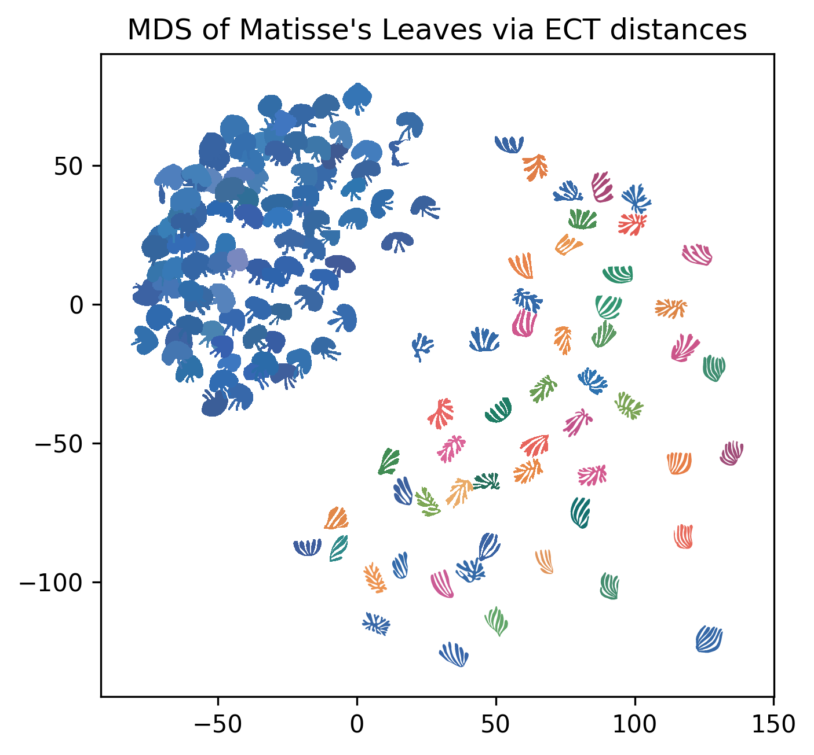
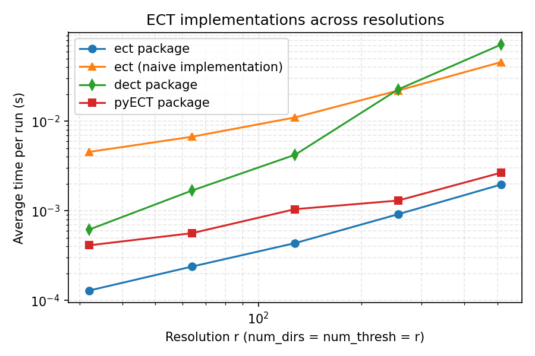

# Summary

The field of Topological Data Analysis (TDA) [@Dey2021;@Wasserman2018;@Ghrist2014;@Munch2017] encodes the shape of data in quantifiable representations of the information, sometimes called "topological signatures" or "topological summaries". The goal is to ensure that these summaries are robust to noise and useful in practice. In many methods, richer representations bring higher computation cost, creating a tension between robustness and speed. The Euler Characteristic Transform (ECT) [@Turner2014;@Munch2025;@Rieck2024] has gained popularity for encoding the information of embedded shapes in $\mathbb{R}^d$---such as graphs, simplicial complexes, and meshes---because it strikes this balance by providing a complete topological summary, yet is typically much faster to compute than its widely used cousin, the Persistent Homology Transform [@Turner2014].

The `ect` Python package offers a fast and well-documented implementation of ECT for inputs in any embedding dimension and with a wide range of complex types. With a few lines of code, users can generate ECT features by sampling directions, computing Euler characteristic curves, and vectorizing them for downstream tasks such as classification or regression. The package includes practical options for direction sampling, normalization, and visualizing various versions of the ECT. These options allow for smooth integration into other scientific packages such as `NumPy`, `SciPy`, and `PyTorch`. By lowering the barrier to computing the ECT on embedded complexes, `ect` makes these topological summaries accessible to a wider range of practitioners and domain scientists.

## The Euler Characteristic Transform

The Euler characteristic is a standard construction from algebraic topology (see, e.g., @Hatcher).
In its simplest form for a given polyhedron $K$, the ECT is defined as the alternating sum $\chi(K) = v_K-e_K+f_K$ where $v_K$, $e_K$, and $f_K$ stand for the counts of the numbers of vertices, edges, and faces in $K$, respectively.
The ECT extends this idea to encode the changing Euler characteristic for sublevel sets of an input space in different directions.
We give a high-level introduction of the ECT here as defined in @Turner2014, and direct the reader to @Munch2025 and @Rieck2024 for survey articles specifically on the subject.
<!-- Further, note that the code is built to handle embedded cell complexes of arbitrary dimension, but for ease of introduction, we explain the basics using embedded graphs. -->

To start, we have input `ect.EmbeddedComplex`, which is a polyhedral complex $K$ (see @Goodman2018, Ch. 17.4) that is a collection of convex polytopes in $\mathbb{R}^n$ closed under the face relation. While we note the code can handle shapes in any dimension, we will give an exposition focusing on the case of a straight-line graph embedding like the example given in \autoref{fig:example_graph} embedded in $\mathbb{R}^2$.

For a choice of direction $\omega \in \mathbb{S}^{n-1}$, we induce a function on the vertex set given by $g_\omega(v) = \langle f(v), \omega\rangle$, the dot product of the embedding coordinates of the vertex with the unit vector $\omega \in \mathbb{R}^n$.
Some examples are shown for the embedded graph in \autoref{fig:example_graph}.
The ECT for the embedded graph is given by
$$
\begin{matrix}
\text{ECT}(G): & \mathbb{S}^1 \times \mathbb{R} & \to &  \mathbb{Z}\\
& (\omega,a) & \mapsto & \chi(g_\omega^{-1}(-\infty,a]).
\end{matrix}
$$
After discretizing, the example embedded graph has an ECT matrix as shown in the bottom row of \autoref{fig:example_graph}.

<!--  -->

<!-- ## Extension to higher dimensional embedding

In theory, the ECT can be defined for a space embedded in $\mathbb{R}^d$ for any $d$. 
In practice, for applications geared toward encoding shapes seen in the physical world, this is largely limited to the cases $d=2$ or $d=3$. 
Still, issues arise in applications in the case of $d=3$ where the choice for discretizing the directions chosen on the sphere $\mathbb{S}^2$ is not canonical like the case of $d=2$ and the circle $\mathbb{S}^1$ [@Mardia1999]. 
To this end we have implemented **Make sure this is true** the 3D ECT for graph inputs. 
In order to handle issues with choices of direction discretiziations, we have implemented multiple options for sampling, **Which ones? **
- Uniform in $\theta$ and $\rho$? 
- Whatever other sampling methods I can find in that directions book. 
- From wikipedia: 
  - [Kent distribution](https://en.wikipedia.org/wiki/Kent_distribution) 
  - [von Mises-Fisher](https://en.wikipedia.org/wiki/Von_Mises%E2%80%93Fisher_distribution#Matrix_Von_Mises-Fisher)

## Capabilities of the `ect` package 

The main functionality of the `ect` package is to compute the ECT using the class `ect.ect.ECT`, including for higher-dimensional structures than described in the previous section.
This can be modified to accept different choices of subsets of directions of the sphere $\mathbb{S}^{n-1}$, including uniform and random sampling methods.
Variants of the ECT are also implemented, including the Smooth Euler Characteristic Transform (SECT) [@Crawford2019;@Meng2022]; and the Differentiable Euler Characteristic Transform (DECT) [@Roell2024]. 
The ECT output can also easily return distances between transforms, generally defined as the $L_p$ distance between two functions $ECT(K_1), ECT(K_2):\mathbb{S}^{n-1} \times \mathbb{R} \to \mathbb{Z}$.

<!--  -->

# Statement of Need

Despite the ECT's mathematical power, there has been a notable absence of efficient, user-friendly, continuously maintained Python packages that can handle the computational demands of modern research datasets. The primary target users of `ect` are researchers and practitioners in topological data analysis and related fields (such as computational geometry, network science, and biological shape analysis) who require scalable, Python-native tools for extracting and using topological features from embedded complexes.

# State of the Field

Since its introduction in @Turner2014, the popularity of the ECT in topological data analysis has grown, and a range of software implementations has emerged.

The package `demeter` ([github.com/amezqui3/demeter](https://github.com/amezqui3/demeter)) was written specifically for 3D voxel data in order to calculate the ECT for barley seeds [@Amezquita2021].
One of the first variations of the ECT is the Smooth ECT (SECT), [@Crawford2019;@Meng2022;@Tang2022].  The related papers come with specific code that are not packaged, are no longer maintained, or are application-specific rather than a lightweight general ECT library ([github.com/lorinanthony/SECT](https://github.com/lorinanthony/SECT), [github.com/lcrawlab/SINATRA-Pro](https://github.com/lcrawlab/SINATRA-Pro) and [github.com/JinyuWang123/TDA](https://github.com/JinyuWang123/TDA)).  

The Differentiable ECT (DECT) [@Roell2024] makes the ECT differentiable so it can be used as an end-to-end trainable component in deep learning pipelines.
The accompanying implementation (`dect`) is written in `PyTorch` and supports GPU acceleration ([github.com/aidos-lab/dect](https://github.com/aidos-lab/dect)).
A similar recently available package, `pyECT` [@CisewskiKehe2025], provides an efficient implementation of the Weighted Euler Characteristic Transform (WECT) using `PyTorch` ([github.com/compTAG/pyECT](https://github.com/compTAG/pyECT)).

A comparison of the running times for a subset of these packages (CPU-only) can be seen in \autoref{fig:benchmark_ect_packages_resolutions}.

# Software Design

The `ect` package focuses on fast computation of the ECT, with additional functionality provided through `SciPy` and `NumPy`.
The embedded polyhedral complex inputs are stored as a class called `EmbeddedComplex` built to encode the combinatorial data for any dimensional complex.
Additional validation tools are provided when structural or geometric constraints are required for the input.
The `ECT` class computes the ECT and the result is stored in an `ECTResult` class, which has additional metadata and visualization capabilities, as well as distance computation built-in.
Modifications in choices of directions for the computation of the ECT are available in the `Directions` class.  
There are also variation classes for the `SECT` and `DECT`.
Additional speed is gained by leveraging Numba's just-in-time compilation to achieve significant speedups over naive Python implementations, making it practical to compute ECTs for large-scale datasets.

# Research Impact Statement

This code has been developed in tandem with a plant morphology collaboration in order to ensure ease of use for domain scientists.
One of the first iterations of the code was used in the *Plants and Python* course [@PlantsAndPython2022] developed for teaching coding and Python to plant biologists (see the 2024 semester here: [github.com/MunchLab/ECT-Leaf-CNN](https://github.com/MunchLab/ECT-Leaf-CNN)).
To date, the updated package has resulted in two posted preprints [@GarciaChavez2026;@Yahiaoui2026].
In addition, the documentation is focused on clear communication of the method for the non-experts.
For example, a tutorial notebook focused on using the ECT for classifying paper cutout shapes from Henri Matisse's 1952 "The Parakeet and the Mermaid" has been used by the authors extensively for tutorials and talks.
Because of the ease of code use reported by the biologists, we expect that the code is in a state to be picked up for many applications in the near future.

# AI Usage Disclosure

The authors used GitHub Copilot to assist with code scaffolding, templates, and early documentation drafts.
All final code was validated through automated tests and manual review by the authors.
The final manuscript text and scientific claims were written and verified by the authors.

# Acknowledgements

This work is based in part upon work supported by the National Science Foundation through grants
CCF-1907591,
CCF-2106578,
and CCF-2142713.
This work was also supported by US National Science Foundation Plant Genome Research Program awards (IOS-2310355, IOS-2310356, and IOS-2310357).

# References
