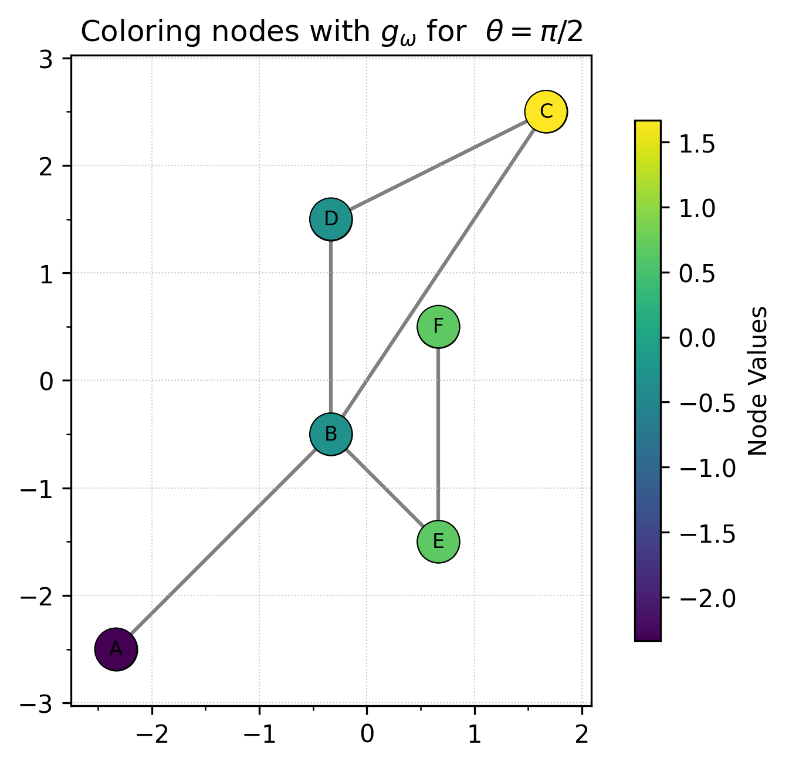

# Summary

The field of Topological Data Analysis encodes the shape of data in quantifiable representations of the information, sometimes called "topological signatures" or "topological summaries". 
The goal is to ensure that these summaries are robust enough to be useable in the face of noise, while having access to fast enough algorithms to make them useful in practice. 
Often, these two goals are at odds with each other since the more complex the representation in order to retain as much information as possible generally results in larger computation time.  
The Euler Characteristic Transform (ECT) is a construction which is rapidly gaining popularity in Topological Data Analysis settings due to its ability to be both at once: robust to the input providing a provably complete representation of an input embedded shape, while being much faster to compute than its commonly used cousin, the Persistent Homology Transform. 
The *ECT* package for Python presented here provides a fast and well-documented implementation of the ECT for graphs embedded in 2 or 3 dimensions. This new package is particularly timely since access to easy-to-use code will make the ECT accessible to more practitioners and domain scientists interested in using it for applications. ***TODO Assuming we actually have this up to 3d***

# The ECT

**TODO: Get permission for the Matisse example image**

We start by defining the Euler Characteristic Transform, and direct the reader to [@Munch2025] for a full survey article on the subject. 

To start, we assume our input is an undirected graph $G$ with an embedding in 2D given by a map on the vertices $f: V(G) \to \mathbb{R}^2$. A graph can be constructed as follows. 

For a choice of direction $\theta \in [0,2\pi]$, we can induce a function on the vertex set. 
Thinking of  this as $\omega \in \mathbb{S}^1$ by defining the unit vector $\omega = (\cos(\theta), \sin(\theta))$, the function $g_\omega$ is defined on the vertices of $G$ by taking the dot product of the embedding coordinates with the unit vector, specifically
$$
g_\omega(v) = \langle f(v), \omega\rangle.
$$
<!-- This is done in the code using the `g_omega` method as shown.  -->

Some examples are shown below. 

Now we can set up the ECT for the embedded graph. The ECT is defined as 
$$
\begin{matrix}
\text{ECT}(G): & \mathbb{S}^1 & \to & \text{Func}(\mathbb{R}, \mathbb{Z})\\
& \omega & \mapsto & \{ a \mapsto \chi(g_\omega^{-1}(-\infty,a]) \}
\end{matrix}
$$
Perhaps a better way of looking at this same function for visualization purposes is to treat this function as defined on a cylinder,
$$
\begin{matrix}
\text{ECT}(G): & \mathbb{S}^1 \times \mathbb{R} & \to &  \mathbb{Z}\\
& (\omega,a) & \mapsto & \chi(g_\omega^{-1}(-\infty,a]) 
\end{matrix}
$$
After discretizing, the example embedded graph has an ECT matrix as shown below. 

The main functionality of the package is to be able to compute the ECT matrix for graphs embedded in $\mathbb{R}^d$ for $d \in \{2,3\}$.
Additional functionality is given for embedded CW complexes, such as the example shown below.  

## Extension to higher dimensional embedding

**TODO: If we're going to have 3D stuff implemented, we need the version for that descibed.**

## Extension to higher dimensional cells

**TODO: add in stuff about the CW complex inputs**

## Distances 

Additional code is included for computing distances between the resulting ECT matrices. 

## Generalized versions of ECT

SECT, DECT, whatever else? 

# Statement of need

**TODO: Are there any existing ECT packages?**

Yemeen is going to find any needed references.

- DECT 
- Demeter 
- 

# Representative Publications Using ECT

Have we actually used it yet? 

# Acknowledgements

This material is based in part upon work supported in part by the National Science Foundation through grants
CCF-1907591,
CCF-2106578,
and CCF-2142713.
**Get the rest?**

# References
